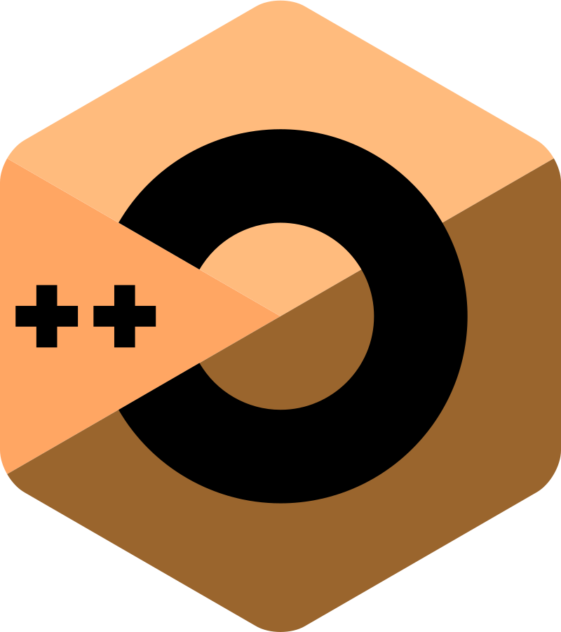

++C/++Ↄ is an esolang that is based on C++.

basic syntax:
```
{
  ;0 nruter
    {
        ;'n\' >> i >> tuoc::dts
    } (++i ;5 => i ;1 = i tni) rof /* count from 1 -> 5 */
} ()niam tni

<maertsoi> edulcni#
```

- It reads from bottom to top, backwards. (rof -> for, int main() -> ()niam tni)
